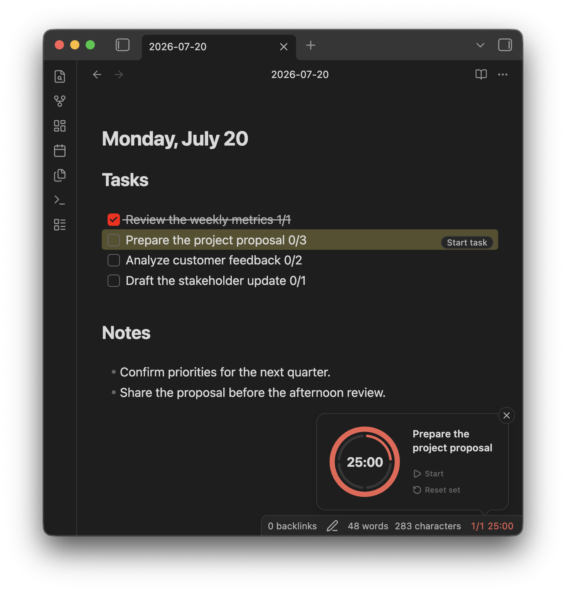

<h1 align="center">Interval Timer for Obsidian 🕔</h1>

<p align="center">
Run configurable focus and break cycles for methods like the <a href="https://www.pomodorotechnique.com/">Pomodoro Technique</a>, and track completed intervals on your task lines.
</p>

<p align="center">
<a href="https://github.com/tamiroh/obsidian-interval-timer/actions/workflows/ci.yml"></a>
<a href="https://codecov.io/gh/tamiroh/obsidian-interval-timer"></a>
</p>

<p align="center">

</p>

## Quick Start

### Start from the status bar

Click the timer in the status bar to start a focus interval. Hover over it to access the timer controls.

### Start from a task line

Add completed and estimated intervals to a task:

```md
- [ ] Prepare the project proposal 0/3
```

Place the cursor on the task and click **Start task**. Each completed focus interval updates the task automatically (`0/3` → `1/3`).

## Installation

Currently, you can install with [BRAT](https://github.com/TfTHacker/obsidian42-brat).
