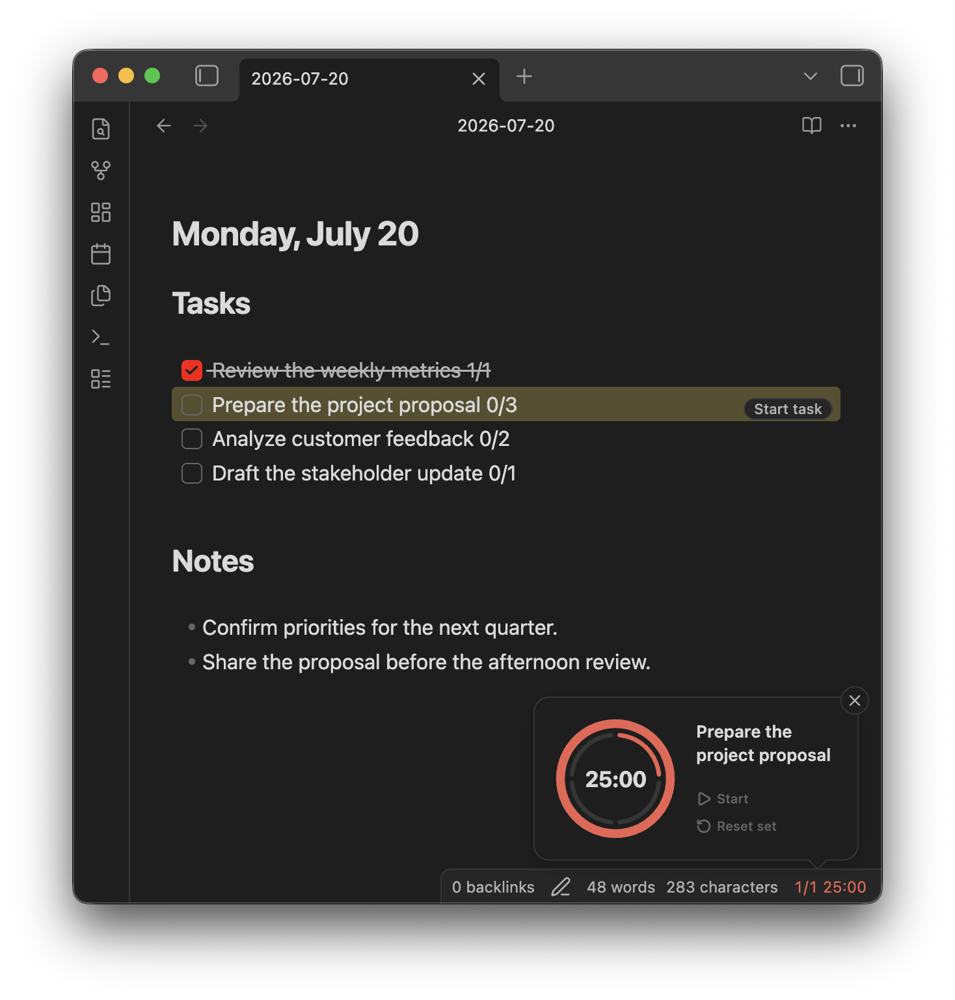

<h1 align="center">⏰ Interval Timer</h1>

<p align="center">
Run focus and break cycles using methods like the <a href="https://www.pomodorotechnique.com/">Pomodoro Technique</a>, and record completed intervals on your Markdown task lines.
</p>

<p align="center">
<a href="https://github.com/tamiroh/obsidian-interval-timer/actions/workflows/ci.yml"></a>
<a href="https://codecov.io/gh/tamiroh/obsidian-interval-timer"></a>
</p>

<p align="center">

</p>

## Concept

- **Compact by design** — A small timer with controls that appear when needed. No dedicated pane, leaving more room for your notes.
- **Start where you plan** — Start a focus session directly from a Markdown task line.
- **Keep effort visible** — Record completed intervals alongside your estimate, even before a task is done.

## Quick Start

### Start from the status bar

Click the timer in the status bar to start a focus interval. Hover over it to access the timer controls.

### Start from a task line

Add completed and estimated intervals to a task:

```md
- [ ] Prepare the project proposal 0/3
```

Place the cursor on the task and click **Start**. Each completed focus interval updates the task automatically (`0/3` → `1/3`).

## Features

- **Focus and break cycles** — Set your own focus, short break, and long break durations, and choose how many focus intervals come before a long break. The interval count resets daily at midnight.
- **Task line tracking** — Start a timer from a task line and the task stays highlighted while it is tracked, with its count updated as intervals complete.
- **Your call when time is up** — Move on to the next interval automatically, or keep counting past zero until you decide to stop.
- **Notifications that fit your setup** — Choose a system or in-app notification, and add a screen flash when you need something harder to miss.
- **Sound to keep the rhythm** — A clock tick and background white noise during focus, plus a time's up sound, each with its own volume.
- **Desktop and mobile** — A status bar timer on desktop, a floating timer on mobile. The running timer and the tracked task survive a reload.
- **Commands for every control** — Start, pause, reset, and skip are available as commands, ready to bind to hotkeys.
